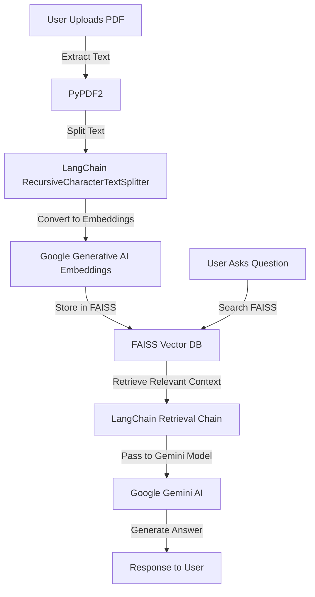

# Multi-PDF Chatbot using Gemini & FAISS

## Overview
This project is an AI-powered chatbot that allows users to ask questions based on the content of uploaded PDF files. It utilizes Google's Gemini AI for generating responses and FAISS for efficient vector-based similarity searches.

## Features
- Upload multiple PDF files and extract text.
- Chunk and store text embeddings using FAISS.
- Retrieve relevant context using semantic search.
- Generate AI-driven answers with Google Gemini AI.
- Streamlit UI for seamless interaction.

## Tech Stack
- **Python** (Core Language)
- **Streamlit** (UI Framework)
- **PyPDF2** (PDF Text Extraction)
- **FAISS** (Vector Search Database)
- **Google Gemini AI** (LLM for Answer Generation)
- **LangChain** (Chaining Prompts & Processing)
- **Hugging Face** (Optional for Custom Embeddings)

## Architecture


## Setup Instructions
### Prerequisites
- Python 3.9+
- Google API Key (for Gemini AI)
- Streamlit Installed

### Installation
```bash
git clone https://github.com/your-username/multi-pdf-chatbot-gemini-faiss.git
cd multi-pdf-chatbot-gemini-faiss
pip install -r requirements.txt
```

### Environment Variables
Create a `.env` file and add your Google API Key:
```env
GOOGLE_API_KEY=your_google_api_key
```

### Run the Application
```bash
streamlit run chat.py
```

## Usage
1. Upload PDF files.
2. Click 'Submit & Process' to extract and index text.
3. Ask questions related to uploaded PDFs.
4. Get AI-generated responses based on document content.

## Contributing
Feel free to submit pull requests and open issues!

## License
This project is licensed under the MIT License.

